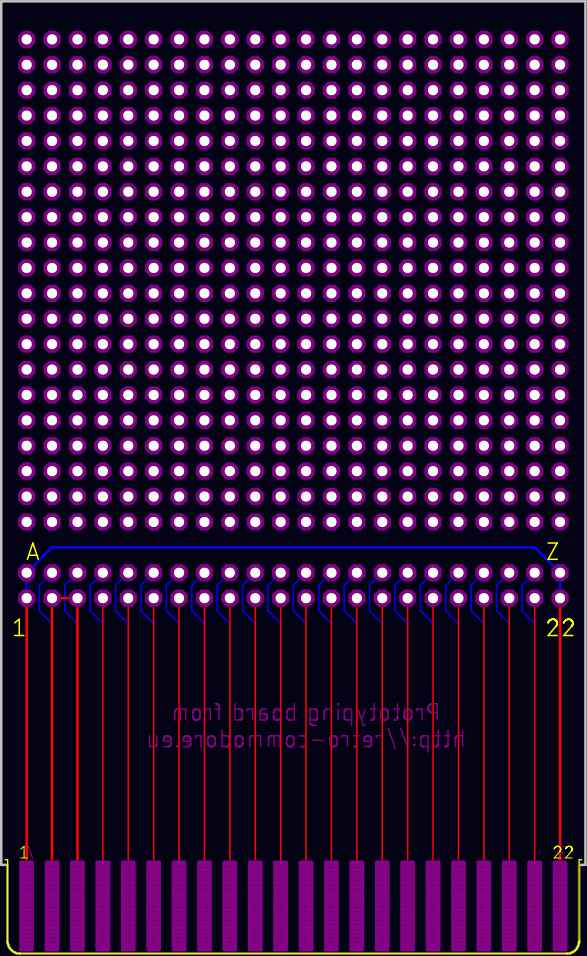

# RCEU2210 - C64 Cartridge Development Board
Another Prototyping cartridge - or developer board

This is used for generic prototyping for which you can make connections soldering wires to the desired pins.

